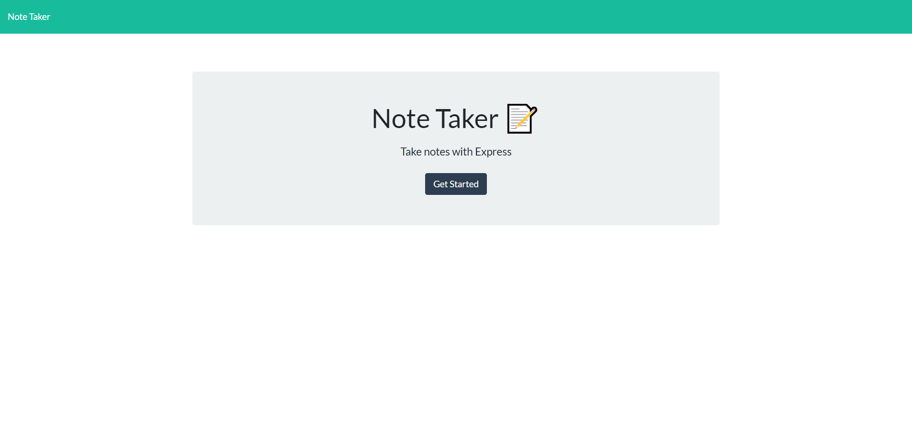
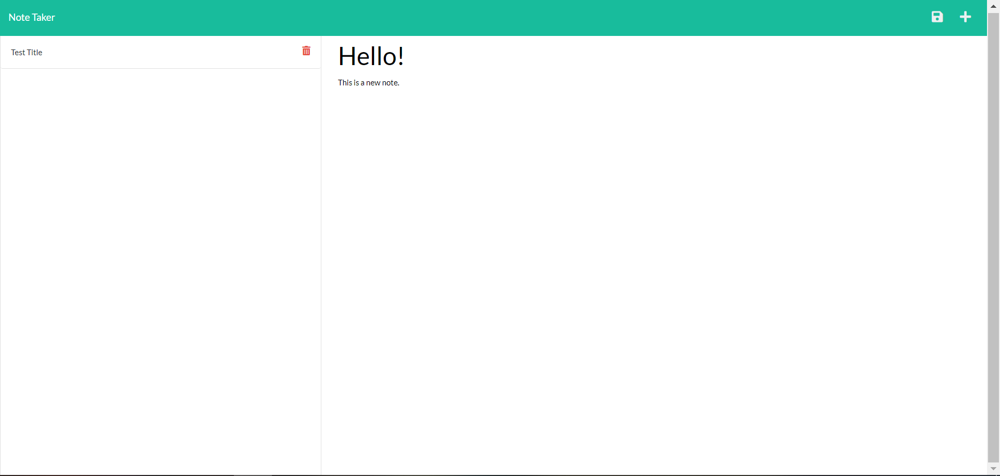
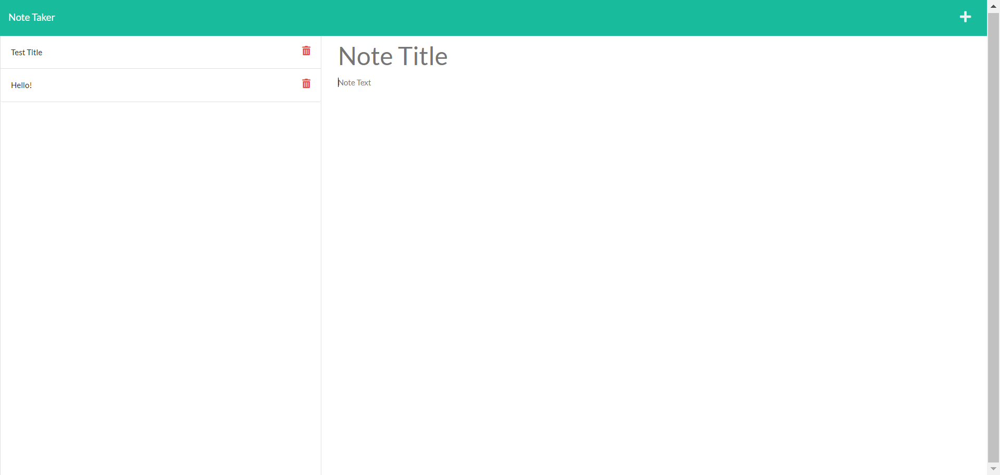
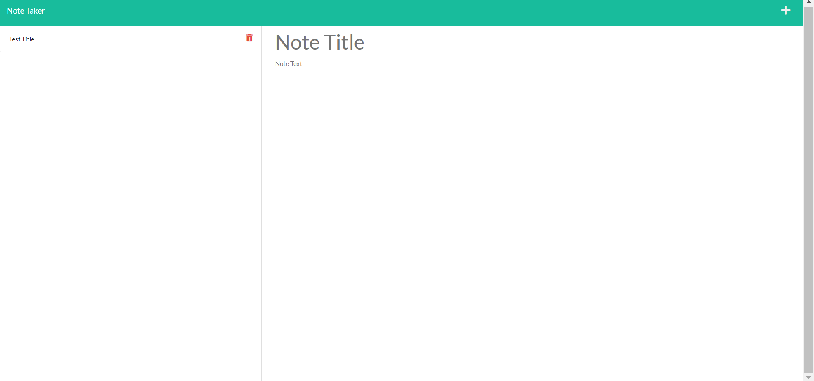

# Express Note Taker App

## Description

A simple note taking application primarily functioned using Express.js

## Table of Contents

-   [Technology](#technology)
-   [Installations](#installations)
-   [User-Story](#user-story)
-   [Links](#links)
-   [Usage](#usage)
-   [License](#license)

## Technology

-   JavaScript
-   Express.js
-   Node.js

## Installations

All dependencies are installed with npm:
`npm install express`
`npm install uuid`

## User Story

The user clicks the link to the deployed application via Heroku

-   The user is presented with the initial landing page. The user clicks the "Get Started" button to begin taking notes.
-   Then the user can create a note by typing in a title and body for the note.
-   The the user saves the note, which is presented on the left side of the page.
-   The user may delete a note by clicking the red delete button. Once the button is clicked, the note is removed from the left side bar.

## Links

To view the deployed application, click here: [https://note-taker-alyssa.herokuapp.com/](https://note-taker-alyssa.herokuapp.com/)
To view our code, click here: [https://github.com/acuson/note-taker](https://github.com/acuson/note-taker)

## Usage

Landing page:

Creating a new note:

Saving a note:

Deleting a note:

## License

This application is using MIT.
